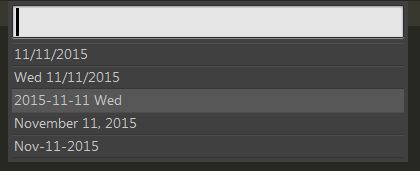

#Insert Date
A simple date insertion plug-in for [Sublime Text][st] 2 and 3. It is primarily based off of [Rob McCormack's code][rmcc] with some tweaks.

##Installation
I haven't gotten it into [Package Control][pc], mainly due to similar naming to [FitcheFoll][ff]. Mine isn't as fancy, there are no dependencies.

##Usage
I didn't build any hotkeys for this, due to personal preference. But can be easily added by setting hotkeys for `insert_date` and `insert_date_panel`. Both show up in the Command Pallette as _"Insert Date: Simple"_ and _"Insert Date: Pop-up"_, respectively.

[st]: http://www.sublimetext.com
[rmcc]: https://www.sublimetext.com/forum/viewtopic.php?f=2&t=13342
[pc]: https://packagecontrol.io/
[ff]: https://github.com/FichteFoll/InsertDate